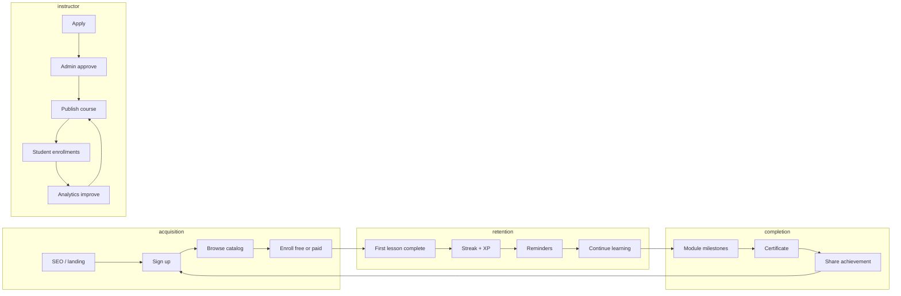

# NMU IntelliLearn — LMS Product & UX Design (Final)

**Status:** Authoritative product spec (replaces any prior instructor/monetization drafts)  
**Stack alignment:** Next.js 14 App Router + PHP/MySQL API + Python proctor service  
**Design system:** Burgundy `#800020`, white, gray scale, 8px grid, modern SaaS minimal

---

## Table of contents

1. [Product strategy](#section-1--product-strategy)
2. [Information architecture (sitemap)](#section-2--information-architecture-full-sitemap)
3. [User flow optimization](#section-3--user-flow-optimization)
4. [Feature priority (MVP → Phase 3)](#section-4--core-features-priority)
5. [Retention & engagement](#section-5--retention--engagement-system)
6. [UI/UX design system](#section-6--uiux-design-system)
7. [Route map vs. current codebase](#section-7--route-map-vs-current-codebase)
8. [Implementation roadmap](#section-8--implementation-roadmap)

---

## Section 1 — Product Strategy

### Core value proposition

**One platform for credible learning, verified assessment, and measurable outcomes.**

| Audience | Promise |
|----------|---------|
| **Students** | Discover courses, learn with clear progress, earn verifiable certificates, stay motivated with streaks and AI help |
| **Instructors** | Apply once, create and publish on-platform, manage learners and improve courses from analytics — no external sales workflow |
| **Admins** | Scale users, approve instructors, moderate content, control revenue and platform policy |
| **Institution (NMU)** | Academic integrity (proctored exams), brand trust, unified data |

Differentiators vs. generic LMS: **integrated proctored exams**, **digital certificates**, **live collaboration**, and a **platform-contained instructor lifecycle** (no Teachable-style external funnels).

### Key growth loops



| Loop | Trigger | Reinforcement |
|------|---------|---------------|
| **Learning habit** | Daily login, lesson complete | Streak counter, XP, badge unlock |
| **Progress visibility** | Dashboard % and “Continue” CTA | Reduces abandonment mid-course |
| **Social proof** | Ratings, completion counts on catalog | Increases enroll conversion |
| **Instructor quality** | Low completion / ratings | Analytics → content updates → better retention |
| **Certificate loop** | Course complete | Download/share → referral back to signup |

### Student engagement strategy

| Mechanism | Purpose | Touchpoints |
|-----------|---------|-------------|
| **Progress bars** | Reduce “where am I?” anxiety | Dashboard, course player, profile |
| **Continue Learning** | Single primary CTA after login | Student dashboard hero |
| **Reminders** | Re-activate dormant users | Email, push, in-app notifications |
| **Achievements** | Milestone celebration | Badges, certificates wall |
| **Assignments & quizzes** | Active recall | Per-module assessments |
| **AI tutor (Phase 3)** | On-demand help | Contextual to current lesson |

### Instructor acquisition strategy (approval-based)

**Platform-contained flow only** — no selling, affiliate links, or external promotion steps in product UX.

```
Apply → Submit credentials/portfolio → Admin review → Verified → Dashboard access
     → Create Course Wizard → Upload content → Structure modules
     → Quizzes/assignments → Submit for moderation → Publish
     → Manage enrolled students → Analytics → Improve course
```

| Stage | Gate | Admin action |
|-------|------|--------------|
| Registration | Form + terms | Queue in approval inbox |
| Pending | No course publish | Email status updates |
| Approved | `role=instructor`, `status=verified` | Audit log |
| First publish | Course moderation | Approve/reject/request edits |
| Ongoing | Quality metrics | Flag low-completion courses |

Monetization for instructors is **platform-mediated** (revenue share / payouts via admin), not self-serve external storefronts.

### Monetization model

| Stream | Model | Owner |
|--------|-------|-------|
| **Course sales** | One-time or bundle pricing on catalog | Platform + instructor split (admin-configured) |
| **Subscriptions** | Monthly/yearly all-access or category plans | Platform |
| **Certificates** | Included in course or premium verified credential | Platform |
| **Institutional** | B2B seat licenses (future) | Admin contracts |

Payment flows live under **Admin → Revenue**; students pay at **enroll/checkout** on-platform only.

### Retention mechanics

| Layer | Features |
|-------|----------|
| **Gamification** | XP per lesson, badges (first course, 7-day streak), leaderboards (optional) |
| **Streaks** | Daily learning goal (minutes or lessons) |
| **Notifications** | Assignment due, exam window, “continue where you left off” |
| **Rewards** | Certificate + confetti on completion; unlock next recommended course |
| **AI tutor** | Phase 3: lesson Q&A, quiz hints, personalized path |
| **Community** | Phase 2: course forums, instructor announcements |

---

## Section 2 — Information Architecture (Full Sitemap)

### Authentication system

| Route (target) | Page | MVP |
|----------------|------|-----|
| `/login` | Login | ✅ Exists |
| `/register` | Sign Up | ✅ Exists |
| `/forgot-password` | Forgot Password | ✅ Exists |
| `/verify-email` | Email Verification | 🔲 MVP |
| `/settings/security` | Two-Factor Authentication | Phase 2 |

**Auth requirements (production):** JWT/session cookies, role claims (`student` \| `instructor` \| `admin`), middleware on protected routes.

---

### Student dashboard

| Route (target) | Feature | Phase |
|----------------|---------|-------|
| `/dashboard` | Overview (stats, continue learning) | MVP ✅ partial |
| `/dashboard/courses` | My Courses | MVP |
| `/learn/[courseId]` | Continue Learning / Course player | MVP |
| `/dashboard/progress` | Course progress tracking | MVP |
| `/certificates` | Certificates & achievements | MVP ✅ |
| `/dashboard/assignments` | Assignments | Phase 2 |
| `/my-exam` | Exams & quizzes hub | MVP ✅ |
| `/dashboard/notes` | Notes system | Phase 2 |
| `/dashboard/downloads` | Downloads center | Phase 2 |
| `/dashboard/calendar` | Calendar & schedule | Phase 2 |
| `/dashboard/notifications` | Notifications center | Phase 2 |
| `/dashboard/wishlist` | Wishlist courses | Phase 2 |
| `/dashboard/forums` | Discussion forums | Phase 2 |
| `/dashboard/ai-tutor` | AI tutor assistant | Phase 3 |
| `/profile` | Profile & settings | MVP ✅ |
| `/courses` | Browse catalog | MVP ✅ |
| `/courses/[id]` | Course detail & enroll | MVP ✅ |
| `/meeting` | Live meetings / chat | MVP ✅ |
| `/video` | Video library | MVP ✅ static |

---

### Instructor dashboard (final flow)

**Canonical instructor journey** — replace any legacy flows that included external selling, sharing for sale, or off-platform promotion.

| Step | Route (target) | Feature |
|------|----------------|---------|
| 1 | `/instructor/apply` | Instructor registration / application |
| 2 | `/instructor/pending` | Awaiting admin approval |
| 3 | `/instructor/dashboard` | Dashboard home (post-approval) |
| 4 | `/instructor/courses/new` | Create course wizard |
| 5 | `/instructor/courses/[id]/content` | Upload videos, PDFs, resources |
| 6 | `/instructor/courses/[id]/structure` | Modules & lessons |
| 7 | `/instructor/courses/[id]/assessments` | Quizzes & assignments |
| 8 | `/instructor/courses/[id]/publish` | Submit & publish to platform |
| 9 | `/instructor/courses/[id]/students` | Manage enrolled students |
| 10 | `/instructor/analytics` | Performance & insights |
| 11 | `/instructor/courses/[id]/improve` | Quality improvements from data |

**Current codebase:** `/instructor/Dashboard` (single mock page) → migrate to structure above.

**Explicitly out of scope for instructor UX:** external storefront setup, social selling wizards, affiliate/promo link builders, payment processor onboarding outside admin/platform billing.

---

### Admin dashboard

| Route (target) | Feature | Current |
|----------------|---------|---------|
| `/admin/dashboard` | Overview | ✅ `/admin/dashboard` |
| `/admin/users` | Students & instructors | ⚠️ `/admin/students` only |
| `/admin/instructors/approvals` | Instructor approval system | 🔲 |
| `/admin/courses/moderation` | Course moderation | ⚠️ `/admin/courses` |
| `/admin/revenue` | Revenue & analytics | ✅ `/admin/analytics`, `/admin/payments` |
| `/admin/reports` | Reports & insights | 🔲 |
| `/admin/support` | Support tickets | 🔲 |
| `/admin/cms` | CMS (pages, banners, FAQ) | 🔲 |
| `/admin/settings` | Platform settings | 🔲 |
| `/admin/exams` | Exam oversight | ✅ |
| `/admin/questions` | Question bank | ✅ |
| `/admin/profile` | Admin profile | ✅ |

---

## Section 3 — User Flow Optimization

### Student funnel

```
Sign up → Browse courses → Enroll → Start learning → Track progress → Complete → Certificate
```

| Step | Drop-off risk | Optimization |
|------|---------------|--------------|
| Sign up | Form friction | Social login optional; minimal fields; email verify async |
| Browse | Choice overload | Recommendations, filters, wishlist |
| Enroll | Payment uncertainty | Clear price, free preview lessons |
| Start | No clear first action | “Start lesson 1” on dashboard; progress 0→1 celebration |
| Track | Invisible progress | Persistent player + % on dashboard |
| Complete | Motivation fade | Streaks, module badges, reminder emails |
| Certificate | Delay | Instant generate on pass + share CTA |

### Instructor funnel

```
Apply → Approved → Create course → Publish → Manage students → Improve content
```

| Step | Optimization |
|------|--------------|
| Apply | Save draft application; status page |
| Approved | Onboarding checklist (profile, first course template) |
| Create | Step wizard with autosave |
| Publish | Moderation preview; rejection reasons |
| Manage | Student table with progress, messaging |
| Improve | Analytics highlights (drop-off lesson, low quiz scores) |

### Cross-cutting optimization goals

1. Reduce onboarding drop-off (progressive profiling after first lesson).
2. Increase **first course completion** (short first module, clear path).
3. Improve engagement post-signup (notification + continue CTA within 24h).
4. Encourage **consistent learning** (streaks, weekly goals).

---

## Section 4 — Core Features Priority

### MVP (Must have)

| Feature | Student | Instructor | Admin |
|---------|---------|------------|-------|
| Authentication (real backend) | ✅ | ✅ | ✅ |
| Student dashboard + continue learning | ✅ | — | — |
| Course player (video + mark complete) | ✅ | — | — |
| Instructor apply + approval gate | — | ✅ | ✅ |
| Course creation wizard (basic) | — | ✅ | — |
| Admin panel basics (users, approve, moderate) | — | — | ✅ |
| Progress tracking (DB-backed) | ✅ | view | view |
| Certificates (issue on completion) | ✅ | — | — |
| Catalog + enroll | ✅ | — | — |

**Preserve NMU differentiators in MVP:** proctored exam path (`/my-exam` → …), meetings, existing `courses.php` / `certificates.php`.

### Phase 2 (Growth)

- Quizzes & exams (deeper integration with question bank)
- Analytics dashboards (instructor + admin live data)
- Notifications (email + in-app)
- Wishlist & recommendations (rules-based)
- Discussion forums

### Phase 3 (Advanced AI)

- AI tutor assistant (LLM + lesson context)
- Smart recommendations (ML or embeddings)
- Auto-generated quizzes from content
- Personalized learning paths

---

## Section 5 — Retention & Engagement System

### Data model (conceptual)

```
User
 ├── streak_current, streak_best, xp_total
 ├── enrollments[] → progress_percent, last_lesson_id, completed_at
 ├── badges[] → earned_at
 └── notification_preferences

Course
 ├── modules[] → lessons[] → duration, type (video|pdf|quiz)
 └── completion_rules (min % lessons, min quiz score)

Events (analytics)
 ├── lesson_completed, quiz_submitted, login_daily, certificate_issued
```

### Gamification rules (defaults)

| Action | XP | Notes |
|--------|-----|-------|
| Complete lesson | 10 | Once per lesson |
| Complete module | 50 | Bonus |
| 7-day streak | 100 | Badge unlock |
| Pass course quiz | 75 | — |
| Earn certificate | 200 | Share prompt |

### Notification triggers

| Trigger | Channel | Copy pattern |
|---------|---------|--------------|
| Inactive 3 days | Email + push | “Continue [Course] — you’re X% done” |
| Assignment due 24h | In-app | Due date + deep link |
| Streak at risk | Push | “Learn 10 min to keep your streak” |
| Course complete | Email | Certificate ready |

### Community (Phase 2)

- Course-level forum threads tied to `course_id`
- Instructor pinned announcements
- Moderation queue in admin

---

## Section 6 — UI/UX Design System

### Design principles

- Modern SaaS, minimal, educational, premium, **WCAG 2.1 AA** accessible
- **8px spacing grid** (4, 8, 16, 24, 32, 48, 64)
- Subtle motion only; fast interactions; no heavy parallax

### Color palette (target — align Tailwind)

| Token | Hex | Usage |
|-------|-----|-------|
| `primary` | `#800020` | CTAs, links, active nav (burgundy) |
| `primary-dark` | `#5A0016` | Hover pressed |
| `primary-light` | `#A0002A` | Subtle backgrounds |
| `secondary` | `#FFFFFF` | Surfaces (light mode) |
| `neutral-50` → `neutral-900` | Gray scale | Text, borders, backgrounds |
| `accent` | `#C9A24D` | Optional gold highlights (certificates, premium) |

**Note:** Current `tailwind.config.ts` uses `#6A0F1C` — migrate to `#800020` during design-system pass.

### Typography

| Role | Font | Weight |
|------|------|--------|
| Headings | Modern sans (e.g. Inter, DM Sans) | 600–700 |
| Body | UI sans | 400–500 |
| Display (optional) | Playfair or similar | Certificates, hero |

### Components

| Component | Variants | Used in |
|-----------|----------|---------|
| **Button** | primary, secondary, ghost, destructive | Global |
| **Card** | course, stat, user, analytics | Dashboards, catalog |
| **Navbar + Sidebar** | student / instructor / admin layouts | App shells |
| **Table** | sortable, paginated | Admin analytics |
| **Form** | auth, wizard steps, settings | Auth, course create |
| **Modal** | confirm, preview lesson | Publish flow |
| **Charts** | line, bar, donut | Recharts on dashboards |

### Motion

- Page transition: 150–200ms fade
- Hover: scale 1.02 max on cards
- Loading: skeleton shimmer, not spinners alone
- Success: brief checkmark micro-animation on lesson complete

### Layout shells

```
┌─────────────────────────────────────────┐
│ Topbar: logo, search, notifications, me │
├──────────┬──────────────────────────────┤
│ Sidebar  │ Main content                 │
│ (role)   │                              │
└──────────┴──────────────────────────────┘
```

---

## Section 7 — Route map vs. current codebase

| Design route | Exists today | Action |
|--------------|--------------|--------|
| `/login`, `/register`, `/forgot-password` | ✅ | Wire to API auth |
| `/dashboard`, `/profile` | ✅ | Split “my courses”, add continue CTA |
| `/courses`, `/courses/[id]` | ✅ | Add enroll + progress API |
| `/certificates`, `/certificates/[id]` | ✅ | Tie to course completion |
| `/my-exam`, exam flow | ✅ | Keep; integrate grades DB |
| `/instructor/Dashboard` | ✅ | Rename → `/instructor/dashboard`; add apply/wizard routes |
| `/admin/*` (8 pages) | ✅ | Add approvals, moderation, CMS |
| `/learn/[courseId]` | ❌ | **MVP:** course player |
| `/instructor/apply` | ❌ | **MVP:** application form |
| `/verify-email`, 2FA | ❌ | MVP / Phase 2 |

---

## Section 8 — Implementation roadmap

### Sprint A — Foundation (MVP auth & shells)

1. `middleware.ts` — protect `/admin/*`, `/instructor/*`, `/dashboard/*`, `/learn/*`
2. PHP auth endpoints: `login`, `register`, `refresh`, `me`
3. Shared layouts: `StudentLayout`, `InstructorLayout`, `AdminLayout`
4. Update `primary` color to `#800020` in Tailwind + CSS variables

### Sprint B — Student learning loop

1. `enrollments` table + API
2. `/learn/[courseId]` player (lesson list + video + mark complete)
3. Dashboard “Continue learning” from `last_lesson_id`
4. Certificate auto-issue on `progress_percent = 100`

### Sprint C — Instructor platform flow

1. `/instructor/apply` + admin approval API
2. Course wizard (metadata → structure → content → publish)
3. Remove/replace any UI copy about external selling
4. Student management per course

### Sprint D — Admin scale

1. Instructor approval inbox
2. Course moderation queue
3. Revenue dashboard wired to real payments (or stub with schema)

### Sprint E — Phase 2 & 3

Follow feature table in Section 4; AI features behind feature flag `ENABLE_AI_TUTOR`.

---

## API sketch (MVP additions)

| Method | Endpoint | Purpose |
|--------|----------|---------|
| POST | `/auth/register` | Student signup |
| POST | `/auth/login` | Issue session |
| GET | `/auth/me` | Current user + role |
| POST | `/instructor/applications` | Submit application |
| PATCH | `/admin/instructors/{id}/approve` | Approve/reject |
| POST | `/enrollments` | Enroll in course |
| GET | `/enrollments/me` | Student courses + progress |
| PATCH | `/progress/lessons/{id}` | Mark complete |
| POST | `/instructor/courses` | Create/update course |
| POST | `/admin/courses/{id}/moderate` | Approve publish |

---

## Consistency checklist

- [ ] Instructor path has **no** external promotion/selling steps
- [ ] All monetization flows through **platform enroll/checkout** and **admin revenue**
- [ ] Student, instructor, admin sitemaps use the routes in Section 2
- [ ] MVP scope matches Section 4 before Phase 2/3
- [ ] Design tokens use burgundy `#800020` and 8px grid
- [ ] Technical docs reference **this file** as product source of truth

---

*Document version: Final — May 2026*
