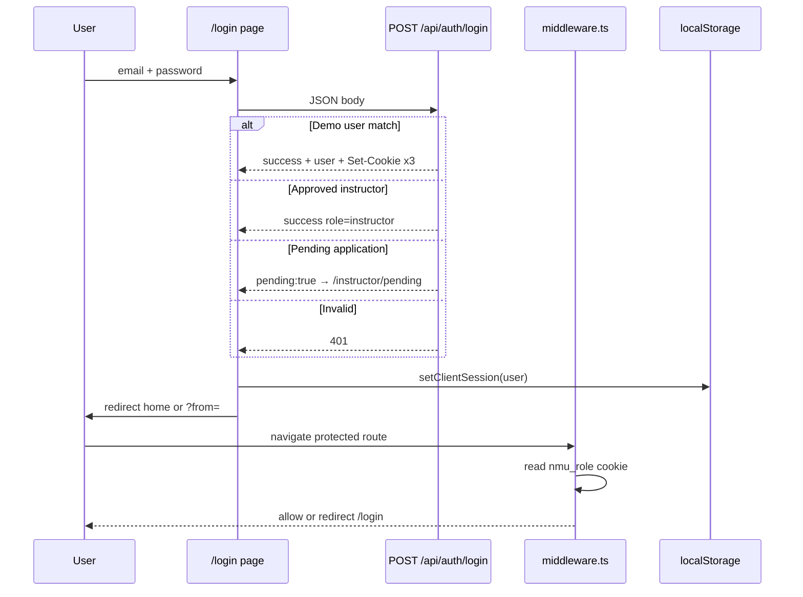
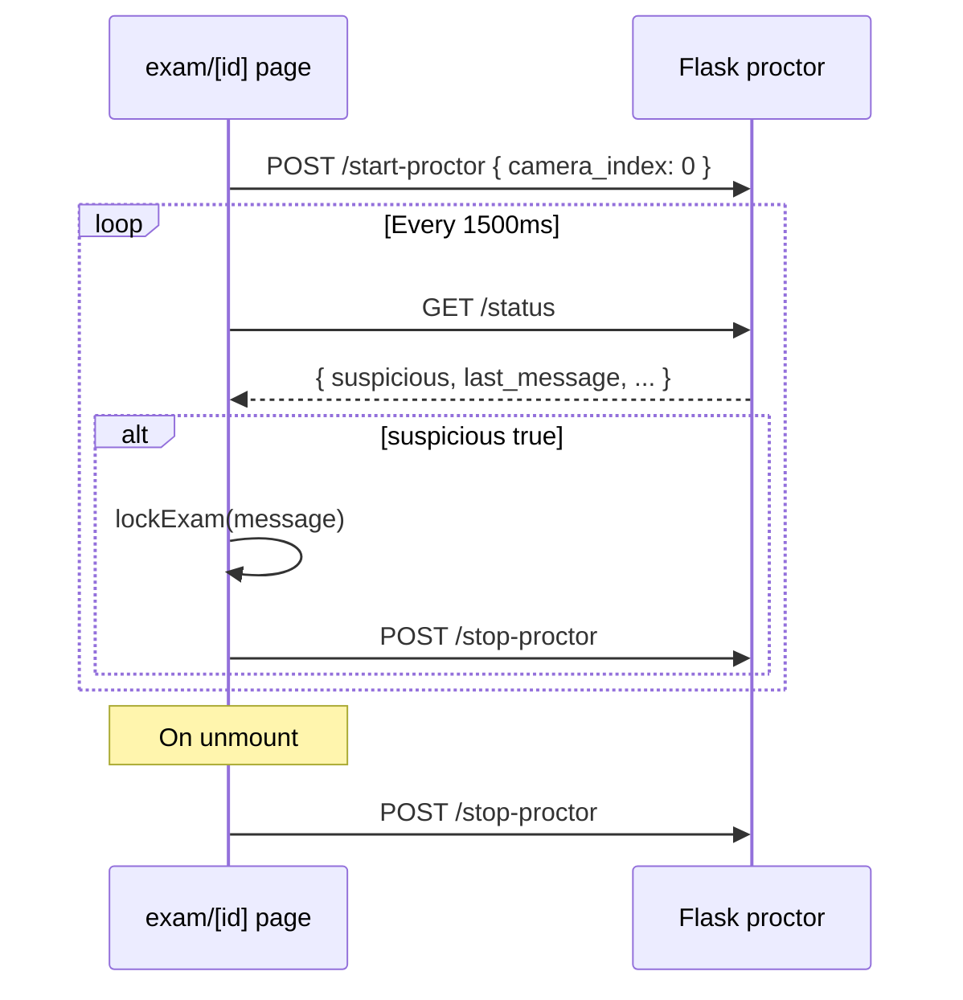

# NMU IntelliLearn — Project Architecture

**Audience:** Senior developers continuing development without owner contact  
**Last updated:** May 2026  
**Version:** 1.0.0 (`package.json`)

This document explains **how the system works**: runtime topology, data flow, authentication, APIs, persistence, exams, proctoring, security, and deployment. For file-by-file placement, see [PROJECT_STRUCTURE.md](./PROJECT_STRUCTURE.md).

---

## Table of contents

1. [System summary](#1-system-summary)
2. [Runtime topology](#2-runtime-topology)
3. [Data flow overview](#3-data-flow-overview)
4. [Authentication flow](#4-authentication-flow)
5. [API flow](#5-api-flow)
6. [Database schema usage](#6-database-schema-usage)
7. [State management](#7-state-management)
8. [Exam workflow](#8-exam-workflow)
9. [AI proctoring workflow](#9-ai-proctoring-workflow)
10. [Security system](#10-security-system)
11. [Route map](#11-route-map)
12. [Feature map](#12-feature-map)
13. [Dependencies](#13-dependencies)
14. [Environment variables](#14-environment-variables)
15. [Deployment requirements](#15-deployment-requirements)
16. [Extension points and known gaps](#16-extension-points-and-known-gaps)
17. [Related documents](#17-related-documents)

---

## 1. System summary

**NMU IntelliLearn** is an e-learning platform for Northern Mediterranean University combining:

- Course catalog and module-based learning (MySQL via PHP)
- Proctored online exams (client-side integrity + optional Python camera service)
- Digital certificates (MySQL via PHP)
- Live meeting chat (JSON file via PHP)
- Role-based UIs for student, instructor, and admin

### Architectural style

| Layer | Pattern |
|-------|---------|
| Frontend | Next.js 14 **App Router**, mostly **client components** (`"use client"`) |
| Auth | **Dual session**: HTTP-only cookies (middleware) + `localStorage` (UI display) |
| Course/cert data | **REST** from PHP; validated with **Zod** on the client |
| Exams | **In-memory demo bank** (`lib/demo-exam.ts`); results in **sessionStorage** |
| Proctoring | **Separate Flask process**; browser polls `/status` |
| Instructor onboarding | **Next.js API** + **JSON file** on server filesystem |

There is **no unified backend** in Node — business data is split across PHP, JSON files, browser storage, and hardcoded demos.

---

## 2. Runtime topology

```
┌─────────────────────────────────────────────────────────────────────────┐
│                         Browser (Student / Staff)                        │
│  Next.js UI ──fetch──► PHP API (courses, certs, chat)                   │
│           └──fetch──► Flask Proctor (start/status/stop)                  │
│           └──fetch──► Next API (/api/auth/*, instructor apply)          │
└─────────────────────────────────────────────────────────────────────────┘
         │                    │                      │
         ▼                    ▼                      ▼
┌──────────────┐    ┌─────────────────┐    ┌──────────────────┐
│ Next.js 14   │    │ nmu-api/ (PHP)  │    │ proctor_server   │
│ :3000        │    │ Apache/:8080    │    │ :5001 (Flask)    │
│ middleware   │    │ PDO → MySQL     │    │ OpenCV + webcam  │
└──────────────┘    └─────────────────┘    └──────────────────┘
                            │
                            ▼
                    ┌───────────────┐
                    │ MySQL pro-gr  │
                    │ + chat JSON   │
                    └───────────────┘
```

### Process responsibilities

| Process | Port (default) | Owns |
|---------|----------------|------|
| `npm run dev` / `start` | 3000 | UI, middleware, Next API routes |
| PHP (`nmu-api/`) | 80/8080 | Courses, certificates, chat |
| `python proctor_server.py` | 5001 | Camera face detection |
| MySQL | 3306 | Relational course/certificate data |

All three app-tier processes must be reachable from the browser for full functionality. Exams **degrade gracefully** if the proctor service is down (camera polling fails silently; browser rules still run).

---

## 3. Data flow overview

### 3.1 Course catalog flow

```
User opens /courses
    → useEffect in courses/page.tsx
    → fetchJson(apiUrl("courses.php"))
    → PHP: SELECT published courses
    → JSON { success, courses[] }
    → CoursesResponseSchema.parse (Zod)
    → React state → render cards
```

Single course (`/courses/[id]`):

```
GET courses.php?id={n}
    → JOIN users for instructor name
    → SELECT course_modules ORDER BY order_index
    → { success, course: { modules: [...] } }
```

### 3.2 Learning progress flow

```
Student enrolls / completes module on /learn/[courseId]
    → enrollCourse() / markModuleComplete() in course-progress.ts
    → localStorage key: nmu_course_progress
    → keyed by student email from localStorage (currentStudentEmail)
```

Progress is **per-browser**, not synced to MySQL.

### 3.3 Certificate flow

```
/certificates → GET certificates.php [?user_id=]
    → MySQL certificates + courses + users
    → Render list

/certificates/[id] → detail view (client-side from list or API)
```

### 3.4 Meeting chat flow

```
/meeting
    → GET chat.php?action=rooms
    → GET chat.php?action=messages&room_id=&last_id=
    → POST chat.php?action=send (JSON body)
    → Persists to nmu-api/chat-storage.json
```

### 3.5 Instructor application flow

```
/instructor/apply (public form)
    → POST /api/instructor/apply
    → createApplication() → data/instructor-applications.json

/admin/instructors/approvals
    → GET /api/admin/instructor-applications
    → PATCH { id, status: "approved"|"rejected" }

/login with approved email
    → findApprovedInstructor() in login route
    → Sets cookies role=instructor
```

### 3.6 Exam results flow

```
/exam/[id] submit
    → gradeExamSubmission(demoExam, answers)
    → saveExamResult() → sessionStorage intellilearn_exam_results
    → router.push(/exam/results/[id])

/exam/results/[id]
    → getExamResult(id) from sessionStorage
    → Display score; essays marked "pending"
```

Results are **lost when the browser session ends** (sessionStorage tab/session scope).

---

## 4. Authentication flow

### 4.1 Design: demo auth + file-backed instructors

Production-grade DB auth is **not implemented**. Instead:

1. **Hardcoded demo users** (`lib/auth/demo-users.ts`)
2. **Approved instructor applications** (`data/instructor-applications.json`)
3. **HTTP-only cookies** for server-side route protection
4. **localStorage** for client UI (name, role, email)

### 4.2 Login sequence



### 4.3 Cookies (server)

| Cookie | Constant | Set by | Purpose |
|--------|----------|--------|---------|
| `nmu_role` | `AUTH_COOKIE_ROLE` | `/api/auth/login` | `student` \| `instructor` \| `admin` |
| `nmu_email` | `AUTH_COOKIE_EMAIL` | Same | User email |
| `nmu_name` | `AUTH_COOKIE_NAME` | Same | Display name |

Options: `httpOnly: true`, `sameSite: lax`, `maxAge: 7 days`, `secure` in production.

Cleared by `POST /api/auth/logout`.

### 4.4 localStorage (client)

| Key | Set when | Purpose |
|-----|----------|---------|
| `nmu_role`, `nmu_email`, `nmu_name` | Login | `getClientSession()` for UI |
| `currentStudentEmail` | Student login | Course progress key |
| `currentInstructorEmail` | Instructor login | Instructor-specific UI |
| `intellilearn_student_name` | Quiz login | Results display name |
| `theme` | Theme toggle | Dark/light |
| `nmu_course_progress` | Learn flow | Enrollment map |

**Important:** Middleware only reads **cookies**. If cookies expire but localStorage remains, the UI may show a name while routes redirect to login — treat cookies as source of truth for authorization.

### 4.5 Middleware rules (`middleware.ts`)

| Condition | Action |
|-----------|--------|
| `/instructor/Dashboard` | 302 → `/instructor/dashboard` |
| `/login`, `/register` + cookie present | Redirect to role home |
| Public prefixes (`/`, `/courses`, `/exam-proctoring`, …) | Allow |
| `/instructor/apply` | Always public |
| No cookie on protected path | Redirect `/login?from=` |
| `/admin/*` | Require `role === admin` |
| `/instructor/*` (except apply) | Require `instructor` or `admin` |
| Student prefixes | Require `student` or `admin` |

**Matcher excludes:** `api`, `_next/static`, `_next/image`, `favicon.ico`, static files with extensions.

### 4.6 Demo credentials

| Role | Email | Password | Home |
|------|-------|----------|------|
| Admin | `admin@knowledgejudge.com` | `Admin123!` | `/admin/dashboard` |
| Student | `gana@example.com` | `Student123!` | `/dashboard` |
| Instructor | `prof.aya@example.com` | `Instructor123!` | `/instructor/dashboard` |

### 4.7 Quiz login (exam-only)

`/quiz-login` is **not** platform auth. It collects name + password (any non-empty password), stores display name, and routes to `/exam/1`. It does not set auth cookies.

---

## 5. API flow

### 5.1 Next.js Route Handlers (same origin)

Base URL: `http://localhost:3000/api/...`

| Endpoint | Method | Body | Response |
|----------|--------|------|----------|
| `/api/auth/login` | POST | `{ email, password }` | `{ success, user? }` + cookies |
| `/api/auth/logout` | POST | — | `{ success: true }` + clear cookies |
| `/api/instructor/apply` | POST | `{ name, email, password, specialty, bio, portfolioUrl? }` | `{ success, application }` |
| `/api/admin/instructor-applications` | GET | — | `{ success, applications[] }` |
| `/api/admin/instructor-applications` | PATCH | `{ id, status }` | `{ success, application }` |

All use **Zod** for request validation where applicable.

### 5.2 PHP API (cross-origin)

Base URL from `NEXT_PUBLIC_API_BASE_URL` (e.g. `http://localhost/nmu-api`).

Helper: `apiUrl("courses.php")` → `{base}/courses.php`

| Endpoint | Method | Query / body | Response shape |
|----------|--------|--------------|----------------|
| `courses.php` | GET | — | `{ success, courses: Course[] }` |
| `courses.php` | GET | `?id={n}` | `{ success, course: CourseDetail }` |
| `certificates.php` | GET | `?user_id={n}` optional | `{ success, certificates: Certificate[] }` |
| `chat.php` | GET | `?action=rooms` | `{ success, rooms }` |
| `chat.php` | GET | `?action=messages&room_id&last_id` | `{ success, messages }` |
| `chat.php` | POST | `?action=send` + JSON | `{ success, message }` |
| `chat.php` | POST | `?action=create_room` + JSON | `{ success, room }` |

CORS handled in `db.php` via `ALLOWED_ORIGINS`.

Client wrapper: `fetchJson<T>()` in `lib/api/client.ts` — throws `ApiError` on HTTP errors or invalid JSON.

### 5.3 Proctor API (cross-origin)

Base URL from `NEXT_PUBLIC_PROCTOR_BASE_URL` (default `http://127.0.0.1:5001`).

| Endpoint | Method | Body | Response |
|----------|--------|------|----------|
| `/start-proctor` | POST | `{ camera_index: 0, ... }` | `{ success, status }` |
| `/stop-proctor` | POST | — | `{ success, status }` |
| `/status` | GET | — | `{ running, suspicious, risk_score, last_message, last_face_count }` |

Called from `app/exam/[id]/page.tsx` only.

---

## 6. Database schema usage

**No SQL files ship with the repo.** PHP expects database `pro-gr` (configurable via `DB_NAME`).

### 6.1 Tables used by `courses.php`

**`courses`**

| Column (in queries) | Usage |
|---------------------|--------|
| `course_id` | Primary key, exposed as `id` |
| `title`, `description`, `long_description` | Copy |
| `duration` | Minutes; mapped to label + level heuristic |
| `rating`, `total_student` | Stats |
| `instructor_id` | FK → `users` |
| `is_published` | Filter `= 1` |
| `created_at` | ORDER BY desc (list) |

**`course_modules`**

| Column | Usage |
|--------|--------|
| `module_id` | Exposed as `id` |
| `course_id` | FK |
| `title`, `duration` | Module card |
| `order_index` | Sort order |

**`users`**

| Column | Usage |
|--------|--------|
| `user_id` | Join from `courses.instructor_id` |
| `first_name`, `last_name` | Instructor display name |

### 6.2 Tables used by `certificates.php`

**`certificates`**

| Column | Usage |
|--------|--------|
| `certificate_id` | `id` |
| `certificate_number` | Display + verification |
| `issued_at`, `expires_at` | Dates |
| `is_verified` | Boolean badge |
| `course_id` | FK → courses |
| `user_id` | FK → users; optional filter |

Joined with `courses` (title) and `users` (holder name).

### 6.3 What is NOT in MySQL today

| Feature | Actual storage |
|---------|----------------|
| Exam questions / attempts | `lib/demo-exam.ts` + sessionStorage |
| Auth users (except implied cert holders) | Demo array + JSON applications |
| Chat | `chat-storage.json` |
| Course progress | `localStorage` |
| Theme | `localStorage` |

---

## 7. State management

### 7.1 Global client state (Zustand)

**File:** `lib/store/theme-store.ts`

| State | Actions | Persistence |
|-------|---------|-------------|
| `theme: "light" \| "dark"` | `setTheme`, `toggleTheme`, `initTheme` | `localStorage.theme` + `<html class="dark">` |

Initialized by `ThemeProvider` on app mount.

### 7.2 Page-local React state

Most pages use `useState` / `useEffect` directly — no Redux/React Query.

Examples:

- `exam/[id]/page.tsx`: `currentQuestion`, `answers`, `timeRemaining`, `proctorSuspicious`
- `courses/page.tsx`: `courses`, `loading`, `error`
- `exam-proctoring/page.tsx`: permission flags

### 7.3 Browser persistence summary

| Storage | Key(s) | Written by | Read by |
|---------|--------|------------|---------|
| sessionStorage | `intellilearn_exam_results` | Exam submit | Results, review-result |
| localStorage | `nmu_*` session | Login | Dashboards, profile |
| localStorage | `nmu_course_progress` | Learn pages | Dashboard continue |
| localStorage | `intellilearn_student_name` | Quiz login | Results header |
| localStorage | `theme` | Theme store | Theme store init |
| HTTP cookies | `nmu_role`, etc. | Login API | middleware |

### 7.4 Server-side file state

| File | Access |
|------|--------|
| `data/instructor-applications.json` | Node fs in API routes only |
| `nmu-api/chat-storage.json` | PHP read/write |

---

## 8. Exam workflow

### 8.1 End-to-end path

```
/my-exam
  → User picks exam card → /exam-proctoring
/exam-proctoring
  → Grant mic, camera, screen share + accept rules
  → /quiz-login
/quiz-login
  → Enter name (password cosmetic) → localStorage student name
  → /exam/1   (hardcoded id in quiz-login; param id from route)
/exam/[id]
  → Load getDemoExam(id) — same question bank, id overwritten
  → Start timer, client proctoring, camera poll
  → Submit → grade → sessionStorage → /exam/results/[id]
/exam/results/[id]
  → Read graded result; MCQ scored, essays pending
```

Alternate: `/review-result?examId=` reads same sessionStorage map.

### 8.2 Question bank

**Source:** `lib/demo-exam.ts` — `JAVASCRIPT_FUNDAMENTALS` exam (5 questions: 4 MCQ, 1 essay).

`getDemoExam(routeExamId)` clones the bank and sets `id` to the route param. **All exam URLs share identical questions** until a DB-backed exam API is built.

### 8.3 Grading logic

**File:** `lib/exam-result-storage.ts` → `gradeExamSubmission()`

| Question type | Scoring |
|---------------|---------|
| `multiple-choice` | Exact match to `correctAnswer` |
| `essay` | Always `status: "pending"` (not auto-graded) |

`scorePercent = round(mcqCorrect / mcqTotal * 100)` — essays excluded from percentage.

Default `passMark = 70`.

### 8.4 Timer

- Initial: `durationMinutes * 60` from demo exam (60 min default)
- `setInterval` 1s decrement unless `proctorSuspicious`
- UI turns timer red when `< 5 minutes`
- Reaching 0 stops timer; does not auto-submit (manual submit still required)

### 8.5 Exam UI architecture (post-redesign)

- Sticky header: title, question index, timer
- Progress bar: answered % (not navigation index)
- Question card + radio/essay input
- Prev / Next / Submit on last question
- Sidebar question navigator (green = answered, primary = current)

**All integrity logic remains in the same page component** — UI changes do not alter hooks.

---

## 9. AI proctoring workflow

Proctoring is **two-layer**: browser client (`exam/[id]/page.tsx`) + optional Python service.

### 9.1 Pre-exam (`/exam-proctoring`)

| Check | Mechanism |
|-------|-----------|
| Microphone | `getUserMedia({ audio: true })` then stop tracks |
| Camera | `getUserMedia({ video: true })` then stop tracks (releases device for Python) |
| Screen | `getDisplayMedia({ video: true })` then stop tracks |
| Rules checkbox | Local state gate |

`canStartExam` requires all three permissions + rules acceptance.

### 9.2 Camera service lifecycle (exam page mount)



### 9.3 OpenCV detection rules (`proctor_server.py`)

| Condition | Threshold (defaults) | Result |
|-----------|----------------------|--------|
| No face | 30 consecutive frames (~0.9s) | `suspicious`, risk 100 |
| Multiple faces | 10 consecutive frames | `suspicious`, risk 100 |
| Exactly one face | Resets counters | OK |

Uses Haar cascade: `Real-time-Face-Recognition-Project-main/haarcascade_frontalface_alt.xml`.

Thread model: daemon thread per start; global mutable status protected by lock for start/stop.

### 9.4 Client-side `lockExam(message)`

When triggered:

1. `lockedRef.current = true` (idempotent)
2. `setProctorSuspicious(true)` + message
3. `fetch(stop-proctor)` (fire-and-forget)
4. Full-screen overlay blocks interaction; only "Exit exam" → `/my-exam`

`forceExitExam` additionally sets `exitedRef` and `window.location.replace("/my-exam")` for tab-switch violations.

---

## 10. Security system

### 10.1 Browser integrity (exam page)

Implemented in `useEffect` hooks in `app/exam/[id]/page.tsx`:

| Control | Trigger | Action |
|---------|---------|--------|
| Tab switch / hidden document | `visibilitychange` + `document.hidden` | `forceExitExam` → `/my-exam` |
| Right click | `contextmenu` | `lockExam` |
| Copy | `copy` event | `lockExam` |
| Paste | `paste` event | `lockExam` |
| Forbidden shortcuts | `keydown` | `lockExam` |
| DevTools heuristic | `setInterval` 1s: outer−inner dimension > 160px | `lockExam` |
| Mouse movement | Sum of \|Δx\|+\|Δy\| over 2.5s ≥ 38000px | `lockExam` |

**Forbidden keys:** Ctrl+C/V/X/T/W/U/I, F12, Ctrl+Shift+I/J/C.

Constants:

```ts
MOUSE_MOVE_WINDOW_MS = 2500
MOUSE_MOVE_LOCK_PX = 38000
```

### 10.2 Route protection

- Edge `middleware.ts` enforces role-based access via cookie
- Next `/api/*` routes are **not** protected by middleware — secure admin APIs before production
- PHP relies on CORS origin allowlist, not JWT

### 10.3 Security limitations (document for production hardening)

| Gap | Risk |
|-----|------|
| Demo passwords in source | Credential leak |
| Instructor passwords in JSON plaintext | File read = account compromise |
| No server-side exam submission | Scores can be forged client-side |
| Proctor API has no auth token | Anyone on network can start/stop |
| DevTools detection is heuristic | Bypassable |
| Quiz login is cosmetic | Not tied to student identity |
| API admin routes unauthenticated | Unauthorized approvals |

---

## 11. Route map

### 11.1 Public (no cookie required)

| Route | Purpose |
|-------|---------|
| `/` | Landing |
| `/login`, `/register`, `/forgot-password` | Auth UI |
| `/courses`, `/courses/[id]` | Catalog |
| `/meeting` | Chat |
| `/video` | Video library |
| `/exam-proctoring` | Pre-exam checks |
| `/instructor/apply` | Instructor application |

### 11.2 Student (+ admin override)

| Route | Purpose |
|-------|---------|
| `/dashboard`, `/dashboard/courses`, `/dashboard/continue` | Student hub |
| `/profile` | Profile |
| `/learn/[courseId]` | Learning |
| `/certificates`, `/certificates/[id]` | Credentials |
| `/my-exam` | Exam list |
| `/quiz-login` | Exam entry |
| `/exam/[id]` | Live exam |
| `/exam/results/[id]` | Results |
| `/review-result` | Alt results |

### 11.3 Instructor (+ admin)

| Route | Purpose |
|-------|---------|
| `/instructor/dashboard` | Instructor home |
| `/instructor/analytics` | Stats |
| `/instructor/courses/new` | Create course UI |
| `/instructor/profile` | Profile |
| `/instructor/pending` | Pending approval message |

### 11.4 Admin only

| Route | Purpose |
|-------|---------|
| `/admin/dashboard` | Admin home |
| `/admin/students` | Student admin |
| `/admin/courses` | Course admin |
| `/admin/exams` | Exam admin |
| `/admin/questions` | Question admin |
| `/admin/analytics` | Analytics |
| `/admin/payments` | Payments |
| `/admin/profile` | Settings |
| `/admin/instructors/approvals` | Approve instructors |

### 11.5 API routes (Next)

| Route | Auth |
|-------|------|
| `/api/auth/login` | Public |
| `/api/auth/logout` | Public |
| `/api/instructor/apply` | Public |
| `/api/admin/instructor-applications` | **Should be admin-only (not enforced today)** |

---

## 12. Feature map

| Feature | Status | Primary files | Backend |
|---------|--------|---------------|---------|
| Landing / marketing | UI complete | `app/page.tsx` | — |
| Dark/light theme | Complete | `theme-store.ts`, `ThemeProvider` | localStorage |
| FAQ chatbot | Complete | `ChatbotWidget.tsx` | Keyword rules in component |
| Course catalog | API-integrated | `courses/page.tsx` | `courses.php` |
| Course detail | API-integrated | `courses/[id]/page.tsx` | `courses.php?id=` |
| Learn + progress | Client-only progress | `learn/[courseId]`, `course-progress.ts` | localStorage |
| Certificates | API-integrated | `certificates/*` | `certificates.php` |
| Live meeting chat | API-integrated | `meeting/page.tsx` | `chat.php` + JSON |
| Student dashboard | UI + partial data | `dashboard/*` | Mixed |
| Instructor dashboard | Demo UI | `instructor/*` | — |
| Admin portal | Demo UI | `admin/*` | — |
| Instructor apply/approve | Functional | API + JSON file | File |
| Platform login | Demo + applications | `login`, `/api/auth/login` | Cookies |
| Exam hub | Static cards | `my-exam/page.tsx` | Hardcoded arrays |
| Proctoring gate | Functional | `exam-proctoring/page.tsx` | Browser APIs |
| Live exam | Functional | `exam/[id]/page.tsx` | demo-exam + proctor |
| Exam results | Functional | `exam/results/[id]` | sessionStorage |
| PDF course export | Helper present | `generateCoursePDF.ts` | Client pdfkit |
| Admin exams/questions | UI placeholders | `admin/exams`, `admin/questions` | Not wired |

---

## 13. Dependencies

### 13.1 Production npm packages

| Package | Version | Role |
|---------|---------|------|
| `next` | ^14.2 | Framework, routing, SSR |
| `react`, `react-dom` | ^18.3 | UI |
| `typescript` | ^5.3 | Types (devDep but used everywhere) |
| `tailwindcss` | ^3.4 | Styling |
| `framer-motion` | ^11 | Animations |
| `zustand` | ^5 | Theme store |
| `zod` | ^3.22 | Validation |
| `react-hook-form` | ^7.50 | Forms |
| `@hookform/resolvers` | ^3.3 | Zod resolver |
| `lucide-react` | ^0.344 | Icons |
| `clsx`, `tailwind-merge` | ^2.x | `cn()` helper |
| `recharts` | ^2.12 | Dashboard charts |
| `jspdf`, `pdfkit`, `html2canvas` | various | PDF/screenshot export |
| `file-saver`, `blob-stream` | — | Download helpers |
| `qrcode.react` | ^4.2 | QR display |

### 13.2 Python (`proctor_server_requirements.txt`)

Typically: `flask`, `flask-cors`, `opencv-python`, `numpy` (install via pip).

### 13.3 PHP extensions

- `pdo_mysql`
- `json`

---

## 14. Environment variables

### 14.1 Next.js (`.env.local`)

| Variable | Required | Default | Description |
|----------|----------|---------|-------------|
| `NEXT_PUBLIC_API_BASE_URL` | Yes (prod) | `http://localhost/nmu-api` | PHP API origin |
| `NEXT_PUBLIC_PROCTOR_BASE_URL` | Yes (prod) | `http://127.0.0.1:5001` | Flask proctor origin |

Embedded at **build time** for client bundles — rebuild after changes.

`NODE_ENV=production` enables `secure` cookies on login.

### 14.2 PHP (`getenv` in `db.php`)

| Variable | Default | Description |
|----------|---------|-------------|
| `DB_HOST` | `127.0.0.1` | MySQL host |
| `DB_NAME` | `pro-gr` | Database name |
| `DB_USER` | `root` | MySQL user |
| `DB_PASS` | `` | MySQL password |
| `DB_CHARSET` | `utf8mb4` | Charset |
| `ALLOWED_ORIGINS` | `http://localhost:3000,...` | Comma-separated CORS |

### 14.3 Python proctor

No env vars — host/port hardcoded in `proctor_server.py`:

```python
app.run(host="127.0.0.1", port=5001, debug=False)
```

Change code or use reverse proxy for production.

---

## 15. Deployment requirements

### 15.1 Minimum production topology

| Tier | Requirement |
|------|-------------|
| Frontend | Node 18+, `npm run build && npm run start` or Vercel |
| PHP API | Apache/Nginx + PHP 8 FPM, HTTPS, env vars |
| MySQL | 5.7+ / MariaDB 10+, schema matching §6 |
| Proctor | Linux/Windows service, **internal network only**, nginx proxy recommended |
| CORS | `ALLOWED_ORIGINS` must list exact frontend URL |

### 15.2 Local development checklist

```bash
npm install && cp .env.local.example .env.local && npm run dev
# PHP: copy nmu-api to htdocs OR php -S localhost:8080 in nmu-api/
# MySQL: create pro-gr, seed courses with is_published=1
pip install -r proctor_server_requirements.txt && python proctor_server.py
```

### 15.3 Build verification

```bash
npm run build   # Must pass TypeScript + Next compile
npm run lint    # ESLint
```

### 15.4 Operational health checks

| Check | URL |
|-------|-----|
| Frontend | `GET /` |
| Courses API | `GET {API}/courses.php` |
| Proctor | `GET {PROCTOR}/status` |
| Exam flow | Manual: my-exam → results |

### 15.5 Files requiring write permissions

| Path | Writer |
|------|--------|
| `nmu-api/` (chat-storage.json) | PHP |
| `data/instructor-applications.json` | Next.js API (Node) |

See [DEPLOYMENT.md](./DEPLOYMENT.md) for Dockerfile, systemd, and nginx examples.

---

## 16. Extension points and known gaps

### Recommended integration order for production

1. **MySQL-backed users + sessions** — replace `demo-users.ts` for login
2. **Exam tables** — questions, attempts, scores; replace `demo-exam.ts` / sessionStorage
3. **Authenticate `/api/admin/*`** — verify `nmu_role === admin` in route handlers
4. **Proctor service auth** — shared secret header between Next server and Flask
5. **Persist exam violations** — server log when `lockExam` fires
6. **Wire admin exam/question pages** to real APIs

### Code entry points for common tasks

| Task | Start here |
|------|------------|
| Add API endpoint (Node) | `app/api/.../route.ts` |
| Add PHP endpoint | `nmu-api/*.php` + `lib/api/contracts.ts` |
| Change exam questions | `lib/demo-exam.ts` |
| Change proctor sensitivity | `proctor_server.py` thresholds + POST body |
| Add protected route | `middleware.ts` prefixes + new page under `app/` |
| Add sidebar link | `components/layouts/nav-config.ts` |

---

## 17. Related documents

| Document | Contents |
|----------|----------|
| [PROJECT_STRUCTURE.md](./PROJECT_STRUCTURE.md) | Folder tree, file responsibilities, component graph |
| [DEPLOYMENT.md](./DEPLOYMENT.md) | Commands, env, troubleshooting |
| [TECHNICAL_DOCUMENTATION.md](./TECHNICAL_DOCUMENTATION.md) | Legacy page-level notes |
| [LMS_PRODUCT_DESIGN.md](./LMS_PRODUCT_DESIGN.md) | Product target / UX spec |
| [PROGRESS_REPORT.md](./PROGRESS_REPORT.md) | Completed vs pending work |
| [README.md](../README.md) | Quick start and demo logins |

---

*This architecture reflects the repository as implemented in May 2026. When implementation diverges from product spec, treat [LMS_PRODUCT_DESIGN.md](./LMS_PRODUCT_DESIGN.md) as the product north star and this document as the code truth.*
