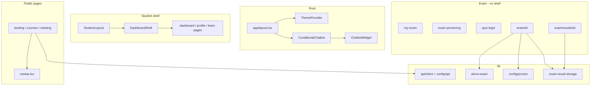

# NMU IntelliLearn — Project Structure

**Audience:** Senior developers onboarding without prior context  
**Last updated:** May 2026  
**Repository root:** `NMU_Intellilearn-Main/`

This document describes **where code lives**, **what each file does**, and **how components relate**. For system behavior, data flow, and security, see [PROJECT_ARCHITECTURE.md](./PROJECT_ARCHITECTURE.md).

---

## Table of contents

1. [Repository overview](#1-repository-overview)
2. [Full folder tree](#2-full-folder-tree)
3. [Directory responsibilities](#3-directory-responsibilities)
4. [App Router — pages and layouts](#4-app-router--pages-and-layouts)
5. [Next.js API routes](#5-nextjs-api-routes)
6. [Components](#6-components)
7. [`lib/` modules](#7-lib-modules)
8. [PHP backend (`nmu-api/`)](#8-php-backend-nmu-api)
9. [Python proctor service](#9-python-proctor-service)
10. [Static assets (`public/`)](#10-static-assets-public)
11. [Configuration and tooling](#11-configuration-and-tooling)
12. [Data files (non-SQL)](#12-data-files-non-sql)
13. [Component relationship map](#13-component-relationship-map)
14. [Path aliases and imports](#14-path-aliases-and-imports)
15. [What is intentionally not in the repo](#15-what-is-intentionally-not-in-the-repo)

---

## 1. Repository overview

NMU IntelliLearn is a **multi-runtime** monorepo-style project:

| Runtime | Location | Role |
|---------|----------|------|
| **Next.js 14** | `app/`, `components/`, `lib/` | UI, routing, demo auth, exam client logic |
| **PHP 8** | `nmu-api/` | MySQL-backed REST for courses & certificates; JSON file chat |
| **Python Flask** | `proctor_server.py` | Camera-based exam proctoring microservice |

There is **no single `src/` folder**. The TypeScript path alias `@/*` maps to the repository root (`tsconfig.json`).

---

## 2. Full folder tree

Excludes `node_modules/`, `.next/`, and `.git/`. This is the **canonical source tree** as of documentation generation.

```
NMU_Intellilearn-Main/
├── app/                                    # Next.js App Router (all UI routes)
│   ├── layout.tsx                          # Root HTML shell, theme, chatbot
│   ├── globals.css                         # Tailwind + CSS variables
│   ├── page.tsx                            # Marketing landing page
│   ├── pdfkit.d.ts                         # Type shim for PDF generation
│   │
│   ├── login/page.tsx
│   ├── register/page.tsx
│   ├── forgot-password/page.tsx
│   │
│   ├── dashboard/
│   │   ├── layout.tsx                      # Student dashboard shell
│   │   ├── page.tsx                        # Student overview
│   │   ├── courses/page.tsx
│   │   └── continue/page.tsx
│   ├── profile/
│   │   ├── layout.tsx
│   │   └── page.tsx
│   ├── learn/
│   │   ├── layout.tsx
│   │   └── [courseId]/page.tsx             # Module learning view
│   │
│   ├── courses/
│   │   ├── page.tsx                        # Catalog (PHP API)
│   │   └── [id]/page.tsx                   # Course detail (PHP API)
│   ├── certificates/
│   │   ├── page.tsx
│   │   └── [id]/page.tsx
│   ├── meeting/page.tsx                    # Live chat (PHP API)
│   ├── video/page.tsx
│   │
│   ├── my-exam/page.tsx                    # Exam hub (static demo data)
│   ├── exam-proctoring/page.tsx            # Pre-exam permissions
│   ├── quiz-login/page.tsx                 # Lightweight exam entry
│   ├── exam/[id]/page.tsx                  # Live proctored exam
│   ├── exam/results/[id]/page.tsx          # Post-submit results
│   ├── review-result/page.tsx              # Alternate results (?examId=)
│   │
│   ├── instructor/
│   │   ├── layout.tsx
│   │   ├── Dashboard/page.tsx              # Legacy casing; middleware redirects
│   │   ├── analytics/page.tsx
│   │   ├── courses/new/page.tsx
│   │   ├── apply/page.tsx
│   │   ├── pending/page.tsx
│   │   └── profile/page.tsx
│   ├── admin/
│   │   ├── layout.tsx
│   │   ├── dashboard/page.tsx
│   │   ├── students/page.tsx
│   │   ├── courses/page.tsx
│   │   ├── exams/page.tsx
│   │   ├── questions/page.tsx
│   │   ├── analytics/page.tsx
│   │   ├── payments/page.tsx
│   │   ├── profile/page.tsx
│   │   └── instructors/approvals/page.tsx
│   │
│   └── api/                                # Next.js Route Handlers
│       ├── auth/login/route.ts
│       ├── auth/logout/route.ts
│       ├── instructor/apply/route.ts
│       └── admin/instructor-applications/route.ts
│
├── components/
│   ├── layouts/
│   │   ├── dashboard-shell.tsx             # Shared sidebar shell (all roles)
│   │   ├── student-layout.tsx
│   │   ├── instructor-layout.tsx
│   │   ├── admin-layout.tsx
│   │   └── nav-config.ts                   # Sidebar link definitions
│   ├── navigation/navbar.tsx               # Public/marketing header
│   ├── providers/theme-provider.tsx        # Mount-time theme init
│   ├── ui/                                 # button, card, input, theme-toggle
│   └── chat/
│       ├── ChatbotWidget.tsx               # FAQ keyword bot
│       └── ConditionalChatbot.tsx          # Route-based visibility
│
├── lib/
│   ├── api/
│   │   ├── client.ts                       # fetchJson + ApiError
│   │   └── contracts.ts                    # Zod schemas (courses, certificates)
│   ├── auth/
│   │   ├── cookies.ts                      # Cookie name constants
│   │   ├── demo-users.ts                   # Hardcoded demo accounts
│   │   ├── session.ts                      # localStorage client session
│   │   └── types.ts                        # UserRole, SessionUser
│   ├── config/
│   │   ├── api.ts                          # apiUrl() → PHP base
│   │   └── proctor.ts                      # proctorUrl() → Flask base
│   ├── data/instructor-applications.ts     # JSON file CRUD (server-only)
│   ├── progress/course-progress.ts         # localStorage enrollments
│   ├── store/theme-store.ts                # Zustand dark/light
│   ├── utils/cn.ts                         # clsx + tailwind-merge
│   ├── demo-exam.ts                        # Static exam question bank
│   ├── exam-result-storage.ts              # Grading + sessionStorage
│   └── pdf/generateCoursePDF.ts            # Client PDF export helper
│
├── nmu-api/                                # PHP REST (separate web host)
│   ├── db.php                              # PDO, CORS, JSON helpers
│   ├── courses.php
│   ├── certificates.php
│   └── chat.php                            # Uses chat-storage.json at runtime
│
├── data/
│   └── instructor-applications.json        # Instructor apply store (git-tracked seed)
│
├── docs/
│   ├── PROJECT_ARCHITECTURE.md             # This companion doc
│   ├── PROJECT_STRUCTURE.md                # ← You are here
│   ├── TECHNICAL_DOCUMENTATION.md          # Legacy detailed doc
│   ├── DEPLOYMENT.md
│   ├── LMS_PRODUCT_DESIGN.md
│   └── PROGRESS_REPORT.md
│
├── public/
│   └── images/                             # Illustrations, patterns, undraw assets
│
├── Real-time-Face-Recognition-Project-main/  # Expected by proctor (Haar cascade)
│   └── haarcascade_frontalface_alt.xml       # Not always present in minimal clones
│
├── middleware.ts                           # Edge auth + role redirects
├── proctor_server.py
├── proctor_server_requirements.txt
├── next.config.js                          # pdfkit webpack aliases
├── tailwind.config.ts
├── postcss.config.js
├── tsconfig.json
├── package.json
├── .env.local.example
├── .eslintrc.json
└── README.md
```

---

## 3. Directory responsibilities

| Directory | Responsibility |
|-----------|----------------|
| `app/` | All user-facing routes, layouts, and Next.js API handlers |
| `components/` | Reusable UI; role layouts wrap `DashboardShell` |
| `lib/` | Shared business logic, API clients, auth helpers, exam grading |
| `nmu-api/` | PHP endpoints consumed by the browser via `NEXT_PUBLIC_API_BASE_URL` |
| `data/` | File-based persistence for instructor applications (server-side only) |
| `public/` | Static files served at `/images/...` |
| `docs/` | Human documentation |
| Root Python | Proctor microservice (not imported by Next.js) |

---

## 4. App Router — pages and layouts

### Root

| File | Type | Responsibility |
|------|------|----------------|
| `app/layout.tsx` | Server layout | Inter font, `ThemeProvider`, `ConditionalChatbot`, site metadata |
| `app/globals.css` | Styles | Tailwind layers; light/dark CSS variables |
| `app/page.tsx` | Page | Public landing / marketing |

### Authentication (public)

| Route | File | Responsibility |
|-------|------|----------------|
| `/login` | `login/page.tsx` | POST `/api/auth/login`, sets cookies + `setClientSession()` |
| `/register` | `register/page.tsx` | Registration UI (demo; not full DB signup) |
| `/forgot-password` | `forgot-password/page.tsx` | Password reset UI (demo) |

### Student experience

| Route | File | Layout | Responsibility |
|-------|------|--------|----------------|
| `/dashboard` | `dashboard/page.tsx` | `dashboard/layout.tsx` → `StudentLayout` | Student home |
| `/dashboard/courses` | `dashboard/courses/page.tsx` | Same | Enrolled courses view |
| `/dashboard/continue` | `dashboard/continue/page.tsx` | Same | Resume learning |
| `/profile` | `profile/page.tsx` | `profile/layout.tsx` | Profile settings UI |
| `/learn/[courseId]` | `learn/[courseId]/page.tsx` | `learn/layout.tsx` | Module player; uses `course-progress.ts` |
| `/certificates` | `certificates/page.tsx` | — | Lists certs from PHP |
| `/certificates/[id]` | `certificates/[id]/page.tsx` | — | Certificate detail |
| `/my-exam` | `my-exam/page.tsx` | — | Static exam cards; links to `/exam-proctoring` |
| `/exam-proctoring` | `exam-proctoring/page.tsx` | — | Browser permission gates |
| `/quiz-login` | `quiz-login/page.tsx` | — | Name/password form → `/exam/1` |
| `/exam/[id]` | `exam/[id]/page.tsx` | — | **Core exam + all client proctoring** |
| `/exam/results/[id]` | `exam/results/[id]/page.tsx` | — | Reads `sessionStorage` results |
| `/review-result` | `review-result/page.tsx` | — | Alternate results reader |

### Instructor experience

| Route | File | Layout | Notes |
|-------|------|--------|-------|
| `/instructor/dashboard` | `instructor/Dashboard/page.tsx` | `instructor/layout.tsx` | Middleware redirects from `/instructor/Dashboard` |
| `/instructor/analytics` | `instructor/analytics/page.tsx` | Same | Charts (demo data) |
| `/instructor/courses/new` | `instructor/courses/new/page.tsx` | Same | Course creation UI |
| `/instructor/apply` | `instructor/apply/page.tsx` | Public | POST `/api/instructor/apply` |
| `/instructor/pending` | `instructor/pending/page.tsx` | Protected | Shown when application pending |
| `/instructor/profile` | `instructor/profile/page.tsx` | Same | Profile UI |

### Admin experience

| Route | File | Responsibility |
|-------|------|----------------|
| `/admin/dashboard` | `admin/dashboard/page.tsx` | Admin KPIs (demo) |
| `/admin/students` | `admin/students/page.tsx` | Student management UI |
| `/admin/courses` | `admin/courses/page.tsx` | Course admin UI |
| `/admin/exams` | `admin/exams/page.tsx` | Exam admin UI |
| `/admin/questions` | `admin/questions/page.tsx` | Question bank UI |
| `/admin/analytics` | `admin/analytics/page.tsx` | Analytics charts |
| `/admin/payments` | `admin/payments/page.tsx` | Payments UI |
| `/admin/profile` | `admin/profile/page.tsx` | Admin settings |
| `/admin/instructors/approvals` | `admin/instructors/approvals/page.tsx` | PATCH applications API |

### Public / hybrid

| Route | File | Data source |
|-------|------|-------------|
| `/courses` | `courses/page.tsx` | `courses.php` |
| `/courses/[id]` | `courses/[id]/page.tsx` | `courses.php?id=` |
| `/meeting` | `meeting/page.tsx` | `chat.php` |
| `/video` | `video/page.tsx` | Static / demo |

---

## 5. Next.js API routes

| Method | Path | File | Responsibility |
|--------|------|------|----------------|
| `POST` | `/api/auth/login` | `api/auth/login/route.ts` | Demo users + approved instructors; sets HTTP-only cookies |
| `POST` | `/api/auth/logout` | `api/auth/logout/route.ts` | Clears auth cookies |
| `POST` | `/api/instructor/apply` | `api/instructor/apply/route.ts` | Writes `data/instructor-applications.json` |
| `GET` | `/api/admin/instructor-applications` | `api/admin/instructor-applications/route.ts` | Lists applications |
| `PATCH` | `/api/admin/instructor-applications` | Same | Approve/reject by id |

**Note:** `middleware.ts` **excludes** `/api/*` from the matcher — API routes are not cookie-gated by middleware; admin UI should enforce auth in production.

---

## 6. Components

### Layout hierarchy

```
RootLayout (app/layout.tsx)
├── ThemeProvider → useThemeStore.initTheme()
├── page content (varies)
└── ConditionalChatbot
    └── ChatbotWidget (hidden on /exam*, /quiz-login, /meeting)

Role layouts:
StudentLayout → DashboardShell(navItems=studentNav)
InstructorLayout → DashboardShell(navItems=instructorNav)
AdminLayout → DashboardShell(navItems=adminNav)
```

### File reference

| File | Used by | Responsibility |
|------|---------|----------------|
| `dashboard-shell.tsx` | All role layouts | Sidebar, mobile drawer, logout, theme toggle |
| `student-layout.tsx` | `dashboard/layout.tsx`, `profile`, `learn` | Wires student nav + session name |
| `instructor-layout.tsx` | `instructor/layout.tsx` | Instructor nav |
| `admin-layout.tsx` | `admin/layout.tsx` | Admin nav |
| `nav-config.ts` | Layouts | `studentNav`, `instructorNav`, `adminNav` arrays |
| `navbar.tsx` | Public pages, some student pages | Top marketing navigation |
| `theme-provider.tsx` | Root | One-time theme hydration |
| `theme-toggle.tsx` | Shell, navbar | Toggles Zustand theme |
| `button.tsx`, `card.tsx`, `input.tsx` | Forms, dashboards | Design system primitives |
| `ChatbotWidget.tsx` | ConditionalChatbot | Keyword FAQ responses |
| `ConditionalChatbot.tsx` | Root | Suppresses bot during exams/meeting |

---

## 7. `lib/` modules

| Module | Client/Server | Responsibility |
|--------|---------------|----------------|
| `api/client.ts` | Both | `fetchJson<T>()`, throws `ApiError` on non-OK |
| `api/contracts.ts` | Client | Zod parsers for PHP JSON shapes |
| `config/api.ts` | Both | `apiUrl("courses.php")` using env base |
| `config/proctor.ts` | Client | `proctorUrl("start-proctor")` using env base |
| `auth/cookies.ts` | Server | `nmu_role`, `nmu_email`, `nmu_name` constants |
| `auth/demo-users.ts` | Server | `DEMO_USERS`, `findDemoUser()` |
| `auth/session.ts` | Client | `localStorage` mirror of user profile |
| `auth/types.ts` | Shared | `UserRole`, `SessionUser` |
| `data/instructor-applications.ts` | Server only | FS read/write `data/instructor-applications.json` |
| `demo-exam.ts` | Client | Static `getDemoExam(id)` — all routes share same bank |
| `exam-result-storage.ts` | Client | `gradeExamSubmission`, `sessionStorage` persistence |
| `progress/course-progress.ts` | Client | Per-email enrollment in `localStorage` |
| `store/theme-store.ts` | Client | Zustand `theme` + `document.documentElement.classList` |
| `utils/cn.ts` | Client | Class name helper |
| `pdf/generateCoursePDF.ts` | Client | PDF export (pdfkit + webpack shims in `next.config.js`) |

---

## 8. PHP backend (`nmu-api/`)

| File | HTTP | Responsibility |
|------|------|----------------|
| `db.php` | — | Included by all endpoints: CORS, PDO singleton, `json_response()` |
| `courses.php` | `GET` | List published courses or single course + modules |
| `certificates.php` | `GET` | List certificates; optional `?user_id=` |
| `chat.php` | `GET`/`POST` | `?action=rooms|messages|send|create_room` |

Runtime-generated (not in git by default):

- `nmu-api/chat-storage.json` — chat messages and rooms

---

## 9. Python proctor service

| File | Responsibility |
|------|----------------|
| `proctor_server.py` | Flask app: `POST /start-proctor`, `POST /stop-proctor`, `GET /status` |
| `proctor_server_requirements.txt` | `flask`, `flask-cors`, `opencv-python`, `numpy` |
| `Real-time-Face-Recognition-Project-main/haarcascade_frontalface_alt.xml` | Face detection model path (required at runtime) |

Consumed only from `app/exam/[id]/page.tsx` via `lib/config/proctor.ts`.

---

## 10. Static assets (`public/`)

| Path | Usage |
|------|-------|
| `public/images/*.png` | Landing, course, exam illustrations |
| `public/images/moroccan-flower.png` | Legacy decorative asset (exam UI no longer uses it) |
| Root-level hashed PNGs referenced in `my-exam/page.tsx` | May be missing in minimal checkouts — exam hub images can 404 |

---

## 11. Configuration and tooling

| File | Purpose |
|------|---------|
| `package.json` | npm scripts: `dev`, `build`, `start`, `lint` |
| `tsconfig.json` | `@/*` → `./*` |
| `tailwind.config.ts` | Brand colors (`primary`, `success`, `error`), dark mode `class` |
| `postcss.config.js` | Tailwind + Autoprefixer |
| `next.config.js` | pdfkit browser fallbacks |
| `middleware.ts` | Route protection by `nmu_role` cookie |
| `.env.local.example` | Frontend public env template |
| `.eslintrc.json` | `eslint-config-next` |

---

## 12. Data files (non-SQL)

| File | Written by | Read by |
|------|------------|---------|
| `data/instructor-applications.json` | `/api/instructor/apply`, admin PATCH | Login (approved instructors), admin GET |
| `nmu-api/chat-storage.json` | `chat.php` | `chat.php` |
| Browser `localStorage` | Login, quiz-login, progress, theme | Dashboards, learn, results name |
| Browser `sessionStorage` | Exam submit | Results pages |

---

## 13. Component relationship map



---

## 14. Path aliases and imports

```ts
import { apiUrl } from "@/lib/config/api";
import { DashboardShell } from "@/components/layouts/dashboard-shell";
```

Alias definition (`tsconfig.json`):

```json
"paths": { "@/*": ["./*"] }
```

---

## 15. What is intentionally not in the repo

| Item | Impact |
|------|--------|
| SQL migration files | Schema must match PHP queries manually |
| Production `.env.local` | Copy from `.env.local.example` |
| `node_modules/`, `.next/` | Generated locally |
| Haar cascade XML | Proctor fails until `Real-time-Face-Recognition-Project-main/` is present |
| MySQL seed data | Courses/certificates empty until DB populated |
| Real backend user table | Login uses demo users + JSON applications |

---

## Related documents

- [PROJECT_ARCHITECTURE.md](./PROJECT_ARCHITECTURE.md) — Data flow, auth, exams, security, deployment
- [DEPLOYMENT.md](./DEPLOYMENT.md) — Step-by-step setup
- [TECHNICAL_DOCUMENTATION.md](./TECHNICAL_DOCUMENTATION.md) — Legacy page-by-page notes
- [LMS_PRODUCT_DESIGN.md](./LMS_PRODUCT_DESIGN.md) — Product target state
